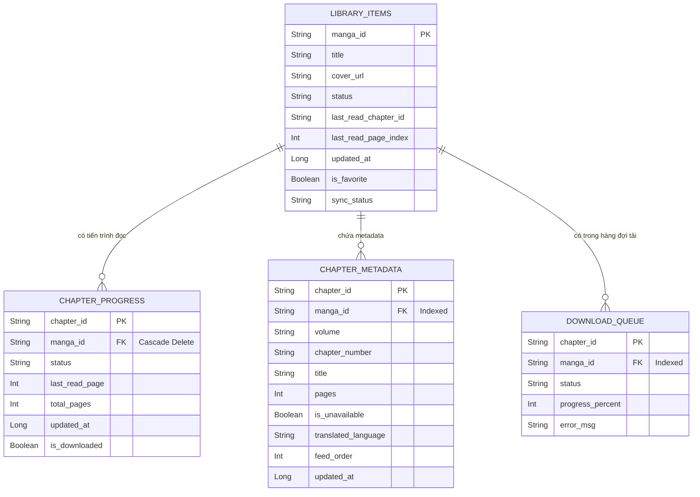

# Lược đồ Cơ sở dữ liệu (Database Schema)

Dựa trên mã nguồn của dự án (Room Database), dưới đây là chi tiết về các thực thể (Entities) lưu trữ dữ liệu cục bộ.

> **Lưu ý về Người dùng (User):** Trong cơ sở dữ liệu Room cục bộ của dự án này không có bảng `User` riêng biệt. Dữ liệu tài khoản người dùng có thể đang được quản lý từ xa qua API/Firebase, hoặc ứng dụng hiện tại chỉ tập trung vào việc quản lý thư viện cá nhân trên thiết bị thông qua các bảng liên quan đến truyện (`library_items`).

## 1. Các bảng (Tables/Entities) chính

### `library_items` (`LibraryItemEntity`)
Lưu trữ thông tin cốt lõi về các truyện (manga/comics) đã được thêm vào thư viện cá nhân.
* **`manga_id`** *(Primary Key)*: Định danh duy nhất của truyện.
* **`title`**: Tiêu đề truyện.
* **`cover_url`**: Đường dẫn tới ảnh bìa của truyện.
* **`status`**: Trạng thái trong thư viện (Ví dụ: `READING` - Đang đọc, `COMPLETED` - Đã hoàn thành, `FAVORITE` - Yêu thích).
* **`last_read_chapter_id`**: ID của chương được đọc gần nhất.
* **`last_read_page_index`**: Vị trí trang đang đọc dở.
* **`updated_at`**: Thời gian cập nhật bản ghi gần nhất.
* **`is_favorite`**: Cờ đánh dấu truyện yêu thích (Mặc định: false).
* **`sync_status`**: Trạng thái đồng bộ hóa dữ liệu với server (Ví dụ: `PENDING_UPDATE`).

### `chapter_progress` (`ChapterProgressEntity`)
Theo dõi tiến trình đọc chi tiết cho từng chương của một truyện. Bảng này có khóa ngoại liên kết trực tiếp với bảng `library_items`.
* **`chapter_id`** *(Primary Key)*: Định danh duy nhất của chương.
* **`manga_id`** *(Foreign Key)*: Tham chiếu đến `library_items(manga_id)`. Xóa tự động (CASCADE) khi truyện bị xóa khỏi thư viện.
* **`status`**: Trạng thái đọc của chương (`UNREAD` - Chưa đọc, `READING` - Đang đọc, `COMPLETED` - Đã hoàn tất).
* **`last_read_page`**: Trang đọc cuối cùng của chương.
* **`total_pages`**: Tổng số trang trong chương.
* **`updated_at`**: Thời gian tiến trình đọc được cập nhật.
* **`is_downloaded`**: Đánh dấu chương đã được tải về máy hay chưa.

### `chapter_metadata` (`ChapterMetadataEntity`)
Lưu trữ các siêu dữ liệu (metadata) của chương truyện giúp hiển thị danh sách chương và thông tin chi tiết mà không cần tải toàn bộ truyện.
* **`chapter_id`** *(Primary Key)*: Định danh duy nhất của chương.
* **`manga_id`**: ID của truyện chứa chương này (Được đánh index để truy vấn nhanh).
* **`volume`**: Tập truyện chứa chương này.
* **`chapter_number`**: Số thứ tự của chương.
* **`title`**: Tiêu đề riêng của chương (nếu có).
* **`pages`**: Số lượng trang.
* **`is_unavailable`**: Đánh dấu nếu chương không khả dụng.
* **`translated_language`**: Ngôn ngữ dịch của chương.
* **`feed_order`**: Thứ tự hiển thị trong danh sách.
* **`updated_at`**: Thời gian cập nhật metadata.

### `download_queue` (`DownloadQueueEntity`)
Quản lý hàng đợi tải xuống các chương truyện để đọc offline.
* **`chapter_id`** *(Primary Key)*: Định danh duy nhất của chương đang được tải.
* **`manga_id`**: ID của truyện (Được đánh index để truy vấn nhanh).
* **`status`**: Trạng thái tải (`PENDING` - Chờ tải, `DOWNLOADING` - Đang tải, `COMPLETED` - Đã tải xong, `ERROR` - Lỗi).
* **`progress_percent`**: Phần trăm đã tải (0-100).
* **`error_msg`**: Thông báo lỗi nếu quá trình tải thất bại.

---

## 2. Sơ đồ Thực thể - Liên kết (ERD)

Sơ đồ ERD dưới đây mô tả cấu trúc và các mối quan hệ (Relationships) giữa các thực thể trong cơ sở dữ liệu:

