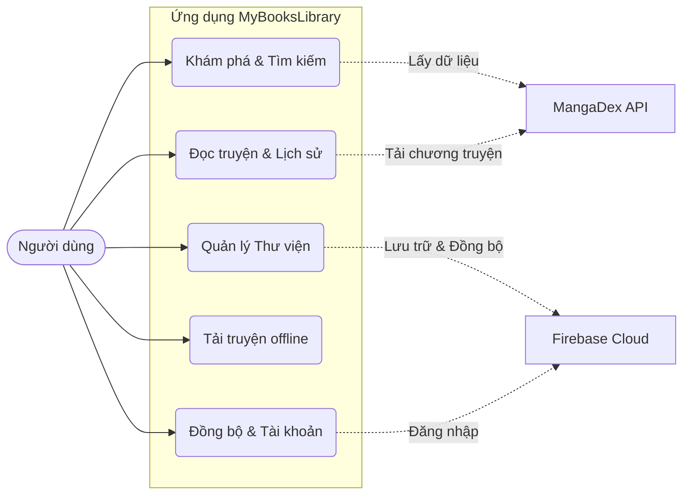
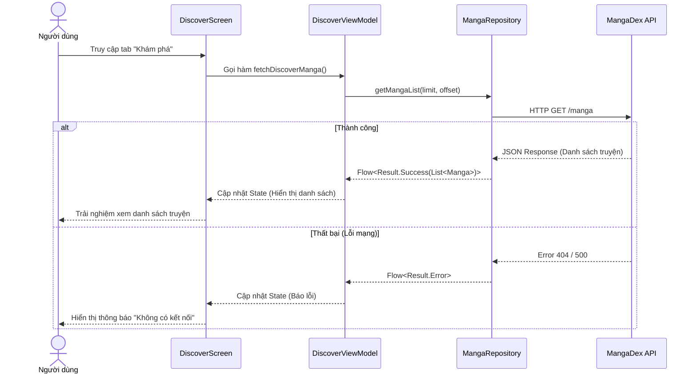
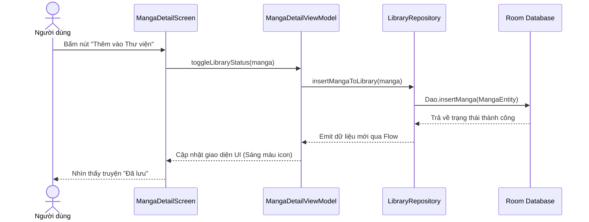

# Phân tích Yêu cầu: Tính năng, Usecase và Luồng Hoạt Động

Dựa trên việc đọc mã nguồn tại các lớp UI (`app/src/main/java/com/example/mybookslibrary/ui/screens`), Domain (`domain/usecase`), và Data (`data/repository`), dưới đây là phân tích chi tiết các tính năng, Usecase và sơ đồ luồng hoạt động chính.

## 1. Các tính năng chính của ứng dụng
Ứng dụng **MyBooksLibrary** xoay quanh việc mang lại trải nghiệm đọc sách/truyện liền mạch, bao gồm:
1.  **Khám phá truyện (Discover)**: Hiển thị các bộ truyện mới cập nhật, phổ biến, hoặc theo xu hướng từ nguồn mạng (MangaDex API).
2.  **Tìm kiếm và Lọc (Search & Filter)**: Tìm kiếm truyện theo tên và sử dụng các bộ lọc nâng cao (SearchFilterSheet) để tìm truyện theo thể loại, tác giả.
3.  **Xem chi tiết và Đọc truyện (MangaDetail & Reader)**: Xem thông tin chi tiết truyện (tóm tắt, tác giả, đánh giá), lấy danh sách chương và giao diện đọc truyện hỗ trợ cả hai chế độ dọc và ngang, có Telephoto để hỗ trợ zoom ảnh.
4.  **Thư viện cá nhân (Library)**: Lưu trữ các bộ truyện người dùng yêu thích, đánh dấu trạng thái (đang đọc, đã hoàn thành...).
5.  **Tải xuống ngoại tuyến (Downloads)**: Tải trước các chương truyện để đọc offline, có thông báo gắn deep link tiến trình tải.
6.  **Thống kê và Lịch sử (Statistics & History)**: Lưu trữ lịch sử các chương đã đọc, hiển thị biểu đồ thống kê thói quen đọc.
7.  **Quản lý Tài khoản (Profile & Auth)**: Đăng nhập (Google Sign-In), đồng bộ dữ liệu người dùng (tiến trình đọc, thư viện) lên nền tảng đám mây (Firebase).

## 2. Xác định các Tác nhân (Actors) và Use Case chính
*   **Tác nhân (Actors):**
    *   **Người đọc (User):** Người trực tiếp tương tác với ứng dụng trên thiết bị Android.
    *   **MangaDex API:** Hệ thống cung cấp nội dung truyện tranh bên ngoài.
    *   **Firebase / Cloud:** Hệ thống lưu trữ và đồng bộ hóa dữ liệu trực tuyến.

*   **Các Use Case (Trường hợp sử dụng) chính:**
    1.  UC1: Tìm kiếm & Khám phá truyện.
    2.  UC2: Xem thông tin và Đọc truyện.
    3.  UC3: Quản lý thư viện cá nhân (Lưu truyện, Theo dõi tiến độ).
    4.  UC4: Tải truyện đọc offline.
    5.  UC5: Đăng nhập và Đồng bộ hóa dữ liệu đám mây.

## 3. Sơ đồ Use Case Tổng Quát
Sử dụng biểu đồ để minh họa các tương tác giữa người dùng và ứng dụng.

## 4. Sơ đồ Tuần tự (Sequence Diagram) các Luồng Quan Trọng

### 4.1. Luồng tải danh sách truyện từ MangaDex (Khám phá truyện)
Luồng này mô tả cách ứng dụng lấy dữ liệu từ MangaDex hiển thị cho người dùng, tuân thủ Clean Architecture.

### 4.2. Luồng lưu truyện vào thư viện cá nhân bằng Room Database
Đây là luồng cho phép người dùng thêm truyện yêu thích vào database local (Room) để theo dõi dễ dàng hơn.

> **Ghi chú**: Các sơ đồ trên có thể được copy trực tiếp vào Markdown của Latex (ví dụ dùng package `markdown` có hỗ trợ mermaid, hoặc vẽ lại trên Draw.io / xuất ảnh từ Typora/GitHub để chèn vào báo cáo dưới dạng ảnh tuỳ theo template của trường).
