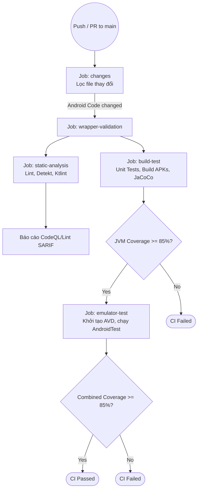

# Bối cảnh Kiểm thử và CI/CD

Tài liệu này tổng hợp cấu hình Kiểm thử tự động (Unit Test, Instrumented Test) và luồng Tích hợp liên tục / Phân phối liên tục (CI/CD) hiện tại của dự án MyBooksLibrary thông qua GitHub Actions.

## 1. Phân tích luồng CI/CD (GitHub Actions)

Luồng CI được cấu hình trong file `.github/workflows/ci.yml`.

**Trigger (Sự kiện kích hoạt):**
- Kích hoạt khi có sự kiện `push` lên nhánh `main`.
- Kích hoạt khi có sự kiện `pull_request` hướng vào nhánh `main`.

**Các Job chính trong luồng:**
1. **`changes`**: Xác định những file nào bị thay đổi để tối ưu hóa thời gian chạy. Quyết định xem có cần chạy Android build, thiết lập Emulator hay chạy Screenshot UI Test không.
2. **`wrapper-validation`**: Xác thực tính toàn vẹn của Gradle Wrapper.
3. **`static-analysis`**: 
   - Kiểm tra kịch bản di chuyển (migration) của Room Database.
   - Chạy các công cụ phân tích tĩnh: Android Lint, Detekt, Ktlint.
   - Tự động đẩy kết quả SARIF lên GitHub Code Scanning.
4. **`build-test`**:
   - Thiết lập JDK 21 và Gradle cache.
   - Chạy Unit test (`testDebugUnitTest`) hoặc UI Screenshot test (`verifyRoborazziDebug`).
   - Biên dịch ứng dụng ra các file APK (`assembleDebug`, `assembleRelease`).
   - Tổng hợp và đánh giá mức độ bao phủ mã (JVM Coverage) bằng JaCoCo. Cảnh báo lỗi nếu Coverage dưới 85%.
   - Báo cáo kích thước APK (APK Size report).
5. **`emulator-test`**:
   - Khởi tạo máy ảo Android (Pixel 6, API 34) sử dụng bộ nhớ đệm (AVD cache) thông qua `reactivecircus/android-emulator-runner`.
   - Chạy Instrumented test (`connectedDebugAndroidTest`).
   - Gộp kết quả độ phủ mã (Combined Coverage) của cả Unit Test và Emulator Test. Nếu tổng Coverage dưới 85% sẽ báo Fail (đối với PR).

### Sơ đồ luồng CI/CD (Mermaid Flowchart)

## 2. Các thư viện Unit Test đang sử dụng

Dự án sử dụng bộ công cụ kiểm thử hiện đại của hệ sinh thái Android và Kotlin:
- **`JUnit 4 / JUnit 5`**: Framework kiểm thử tiêu chuẩn chạy trên máy ảo JVM.
- **`MockK`**: Thư viện dùng để giả lập (mocking) các class, object, interface trong Kotlin (thay thế cho Mockito). Giúp giả lập tầng Repository, DataStore.
- **`kotlinx.coroutines.test`**: Thư viện cung cấp `runTest`, `StandardTestDispatcher` để kiểm thử mượt mà các suspend function và luồng xử lý bất đồng bộ.
- **`Robolectric`**: Cho phép chạy các bài kiểm thử liên quan đến Android component (như `SavedStateHandle`, `Context`) trực tiếp trên JVM mà không cần máy ảo thực tế để tăng tốc độ.
- **`Roborazzi`**: Công cụ chụp và so sánh ảnh màn hình (Screenshot testing) ở cấp độ Compose UI.

## 3. Tóm tắt kịch bản Unit Test tiêu biểu

**File: `app/src/test/java/com/example/mybookslibrary/ui/viewmodel/MangaDetailViewModelTest.kt`**

Đây là một file test tiêu biểu cho một lớp ViewModel chứa logic nghiệp vụ phức tạp liên quan đến Chi tiết truyện.

**Kịch bản kiểm thử chính:**
1. **Quản lý luồng tải xuống ngoại tuyến:**
   - *Test: `startChapterDownload_delegatesToOfflineDownloadManager`*
   - Khởi tạo `MangaDetailViewModel` với một `OfflineDownloadManager` đã được mock.
   - Gọi hàm `startChapterDownload(CHAPTER_ID)`.
   - *Kết quả mong đợi:* Xác minh (Verify) rằng ViewModel gọi chính xác phương thức `enqueueDownload()` của manager một lần.
   - Kịch bản tương tự cho việc Hủy (`cancelChapterDownload`) và Xóa (`deleteChapterDownload`) chương truyện.

2. **Cập nhật dữ liệu thiết lập người dùng:**
   - *Test: `selectLanguage_updatesDataStore`*
   - Khởi tạo ViewModel với `UserPreferencesDataStore` đã được mock.
   - Gọi hàm `selectLanguage("vi")`.
   - *Kết quả mong đợi:* Xác minh rằng ViewModel gọi chính xác phương thức lưu trữ `setPreferredChapterLanguage("vi")` xuống tầng DataStore thông qua coroutine.

*Nhận xét:* ViewModel được test theo chuẩn nguyên lý cô lập (Isolation). Toàn bộ các Data Layer dependencies như `MangaRepository`, `LibraryRepository` đều được giả lập (MockK) để chỉ tập trung xác minh hành vi của luồng Presentation.
